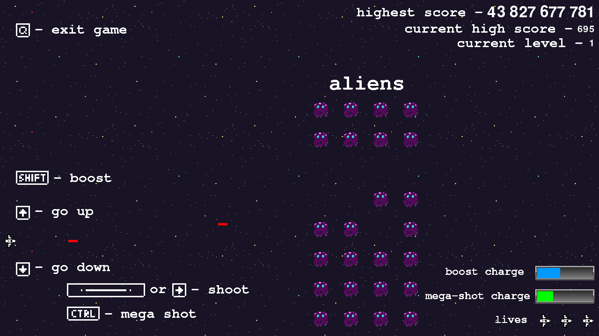

# About

This game is my Sideways Shooter project form [Python Crash Course by Eric Matthes](https://ehmatthes.github.io/pcc_3e/)
This was my playground to implement features I supposed would make better user expierience.

# Gameplay

Gameplay is pretty straightforward. Game is a copy of Alien Invasion, but the Aliens are not shooting at you and there is no barriers.
You need to complete 20 levels. Each level has a number of Aliens which need to be destroyed for the game to advance.

You will lose if an alien touches the ship or left side of the screen.
To quit the game press `Q` or close the widow.

### Score

Your effeciency is mwasured by the `Score` stat which can be seen in top right corner of the window.
You get points for killing the Aliens.
However you will lose points for missing the shots.

# Controls

Controls for the game are described in the image lower.

In order to move Up or Down you need to press `Arrow Up` or `Arrow Down`.
To shoot press `Space` or `Arrow Right`. Countinious shooting can be acieved by holding the `Shoot` button,
however shooting frequency will be lower than the one achieved by button mashing.

## Abilities

To help you with destroyment of the Aliens your ship is equiped with to abilities:

- Ship Boost
- Mega Shot

### Ship Boost

With this ability you can move quickly in one direction.
To use it press: `Shift + Direction Arrow`.
Ability has a cooldown which is shown in the bottom right corner of the widnow.
Cooldown bar has a blue colour.

### Mega Shot

This ability lets you shoot an unstoppable bullet wich shots through every enemy.
To use it press: `Ctrl`.
Ability has a cooldown which is shown in the bottom right corner of the window.
Cooldown bar has a green colour.

# Menu

In the pause menus you can:

- Start a new game.
- Countinue current game.
- Look at game Controls.
- Load a save.
- Save a game.

### Saves

Only one save supported.
Only the beginnig of the current level is saved. Actual position of the aliens is not saved.

# Credits

Assets were taken from [opengameart](https://opengameart.org).

Thanks to [Kutejnikov](https://opengameart.org/users/kutejnikov) for background [image](https://opengameart.org/content/space-9).

Thank to [hookiz](https://opengameart.org/users/hookiz) for the [ship](https://opengameart.org/content/ship-space-0).

Thanks to [Bert-o-Naught](https://opengameart.org/users/bert-o-naught) for the [aliens](https://opengameart.org/content/space-shooter-top-down-2d-pixel-art).

Thanks to [Jannax](https://opengameart.org/users/jannax) for the [cooldown bars](https://opengameart.org/content/sleek-bars).

